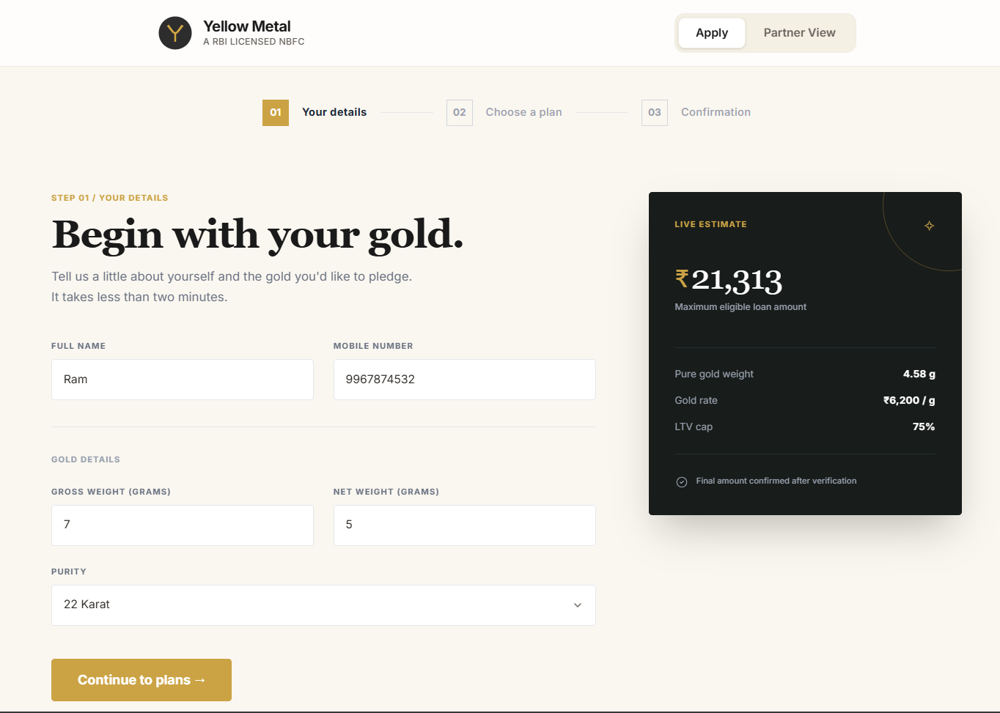
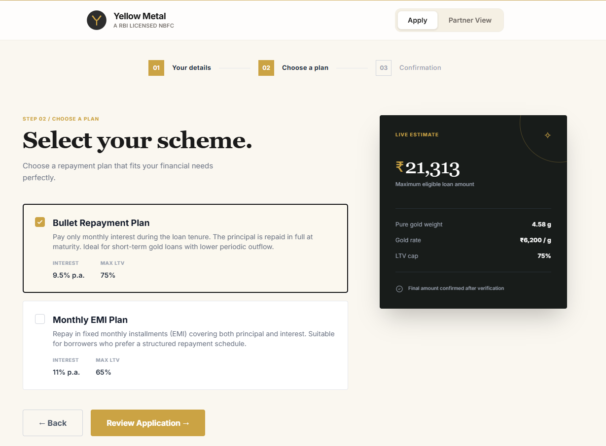
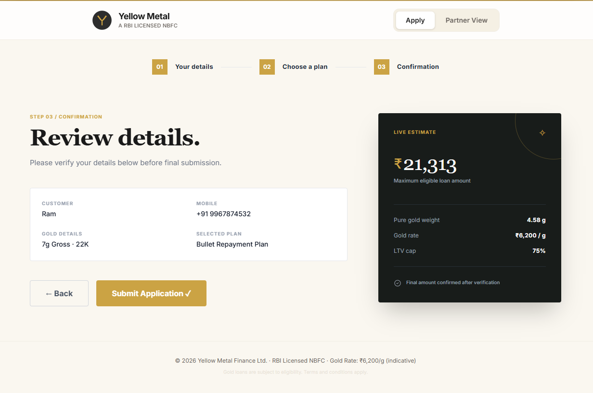
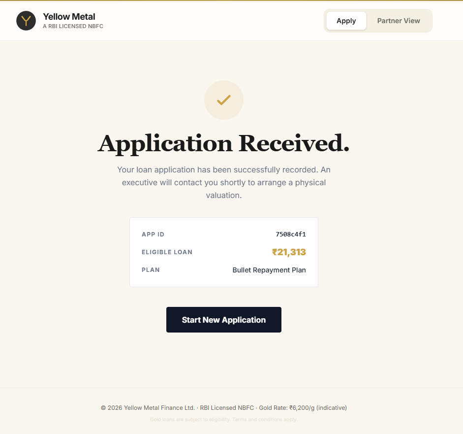
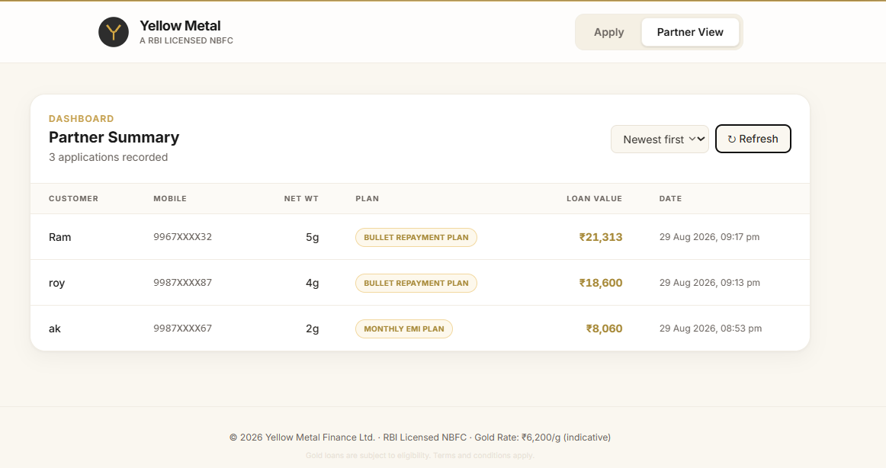
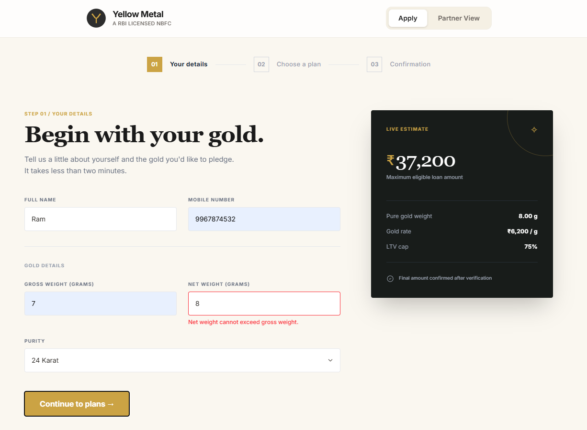

# Application Screenshots

A visual walkthrough of the Yellow Metal Gold Loan Lead Intake Portal.

## Screenshots

### Step 1 — Customer & Gold Details

*Live-updating estimate panel recalculates pure gold weight and eligible loan amount as the user types.*

### Step 2 — Choose a Plan

*Bullet Repayment (9.5% / 75% LTV) vs Monthly EMI (11% / 65% LTV) — selectable scheme cards.*

### Step 3 — Review & Submit

### Confirmation

*Generated Application ID, final eligible loan amount, and selected plan.*

### Partner Summary Dashboard

*Mobile numbers masked (e.g. `9967XXXX32`), sorted newest first.*

### Validation in Action

*Net weight exceeding gross weight is rejected inline before submission.*
